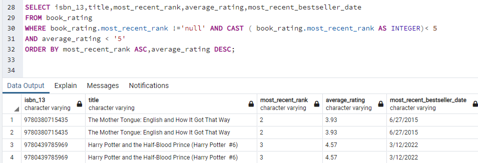
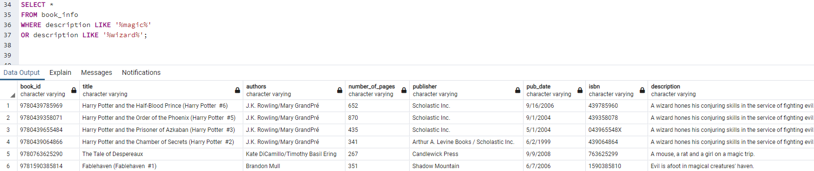
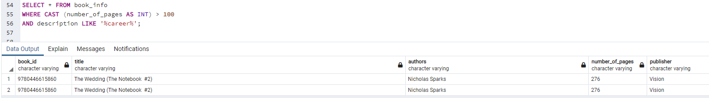
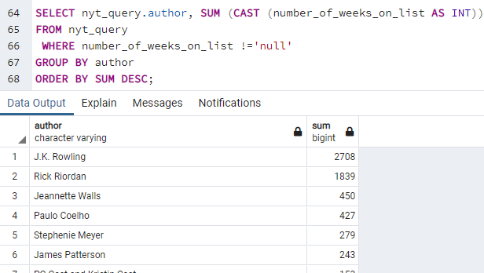

## ETL:

__Extract:__ read the data, often from multiple sources/formats.
- Extracted book titles, ratings, genre, and the number of book pages from the Goodreads CSV file.
- Extracted data from NYT API based on ISBN

__Transform:__ clean and structure the data to suit business needs.
- Cleaned data by removing irrelelevant columns.
- Renamed columns.
- Located and corrected duplicate values.
- Created an ERD table by defining primary keys and relative information to join tables. 
- Link to _[ERD](Resources/erd.png)_

__Load:__ load the data into a database for storage that can be used for future analysis or business use.

- Exported pandas df to a csv file. 
- Merged data into SQL database.

##  Objective: 
####  To create a consolidated database with information on books, i.e., bestsellers, bestselling authors, highest rated books, and year. 
 

## Members: _[Group Repo](https://github.com/JWatson1102/Project_2.git)_

- Josh Watson
- Amy Castillon
- George Vallejo
- Mindy Garcia

     

***
Over 900 million books are sold in the US each year. The pandemic brought a surge in book sales, with 2020 setting a record for print and ebook sales. In addition, there are over 2 million released each year. With this many sales and releases, it can be daunting to find your next read, even more so if you're opening up a small bookshop. Across the US, rent has risen, making it difficult for small businesses, so many people have decided to take their business venture on wheels, including bookshops. As a result, there has been an emergence of "Books on Wheels" shops popping up across the US. With such a small space, owners must have the most relevant books in stock. Our dataset can help business owners find recently listed books in the NYT bestsellers list and find what has remained a top seller throughout the years. In addition, Goodreads is a top-rated book app that gives bookworms a place to see reviews and ratings. Combining these two datasets will help bookstores or readers find the most popular and relevant books to stock up on. 

***

## Data sources:

> - __[New York Times API ](https://developer.nytimes.com/docs/books-product/1/routes/lists.json/get)__ 

> - __[Goodreads Books](https://www.kaggle.com/jealousleopard/goodreadsbooks?select=books.csv)__ 

> The two sources we extracted were in different formats. Goodreads data was extracted from Kaggle in CSV form. Our NYT data was extracted from an API in JSON format. Once we pulled the data from both sources, we then exported the data into CSV files. Finally, we created schemas and uploaded the CSV files into their respective tables so we could perform joins and queries.

## Data Cleaning: CSV File
The original csv file (book.csv)looked as follows: 

The isbn-13, which would later become our book id, was in scientific notation and had to be converted into standard notation before uploading it into our database. Once the csv file was loaded and read into our database it resulted in the following table:

 The uploaded and read table contained information relating to over 11,000 books. The information included title, authors, publisher, ratings, etc. There were several columns that had to be removed (bookID,language_code,Unnamed:12) because they were not pertinent to the project. Once those columns were dropped, we renamed and reordered the remaining columns for better readablity and importance. We then set our ISBN-13 column to our index (unique identifier), as it is a number that is unique to a specific book. The resulting table was as follows:

 

 The resulting table provided a cleaner and more readable information tool.

 ## Data Extraction: New York Times API
 - Imported book_df.csv which contained 11,127 ISBN-13's and saved as a dataframe
 - Sorted dataframe from highest number of total ratings to lowest
 - Once sorted, saved the ISBN-13's into a list to be able to query
 - Used a loop to query the NYT API for the first 2,000 ISBN-13's
 - Queried 500 at a time due to how long it took, and to minimize errors
 - After first 500 queried, printed response list and realized multiple ISBN-13's were not on the NY Times Best Seller list, or were missing information
 - Created for-loop for response list to append query results into lists and created column names
 - Continued to query 500 at a time until we queried a total of 2,000 ISBN-13's
 - Created separate dataframes for each query of 500
 - Of the 2,000 ISBN-13's queried, only 267 were on the NY Times Best Seller list
 - Merged all dataframes into one and saved as main_table.csv
 - The NYT API has a query limit of 4,000 per day with 10 queries per minute, this greatly slowed down the process which is why we decided to just do the first 2,000. Querying 2,000 ISBN-13's took over 4 hours.
 
 ## Sample Queries
 - This is how someone could query to find which books have recently achieved a specific ranking recently. 
 
 
 - Perhaps your Books on Wheels shop will be circling the Fantasy Comicon in the next few months and you want to have magical books in your caravan. This 
 would be the query you would run if you're looking for a book with magic in the description. 
 
 
 - This is an example of how someone could query to find a book pertaining to a particular topic with a specified number of pages.
 
 
 - This is how someone could query a book title that was written by a certain author and that title has spent the most weeks on the New York Times  
   Bestseller list.
   
  
 
 ## Problems Encountered Througout This Project
 
 - API pull took over 4 hours to pull 2,000 book titles. 
 - ISBN-13 were incorrect in some instances and had to be manually inputted after searching for them online. 
- Our schema only excepted VARCHAR and wouldn't allow INTEGER when importing our csv file. We had to use the CAST function to convert the string into a integer when     performing operations on our data. 
 - several rows where not aligned properly with the columns and those rows has to be altered to fit the correct table column format. 

