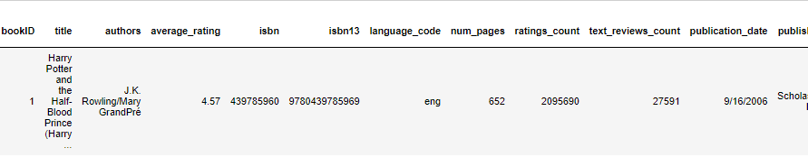

# ETL : Extract, Transform, Load:
__Extract:__ read the data, often from multiple sources/formats.

__Transform:__ clean and structure the data to suit business needs.

__Load:__ load the data into a database for storage that can be used for future analysis or business use.

With over a million new releases each year, the book industry can seem daunting when looking for a good read. However, finding the bestsellers, ratings, and book size can help customers decide if they should start that lengthy novel over their short weekend. 

# Data Cleaning: CSV File
The original csv file (book.csv)looked as follows: 

The isbn-13, which would later become our book id, was in scientific notation and had to be converted into standard notation before uploading it into our database. Once the csv file was loaded and read into our database it resulted in the following table:

 The uploaded and read table contained information relating to over 11,000 books. The information included title, authors, publisher, ratings, etc. There were several columns that had to be removed (bookID,language_code,Unnamed:12) because they were not pertinent to the project. Once those columns were dropped, we renamed and reordered the remaining columns for better readablity and importance. We then set our ISBN-13 column to our index (unique identifier), as it is a number that is unique to a specific book. The resulting table was as follows:

 

 The resulting table provided a cleaner and more readable information tool.

